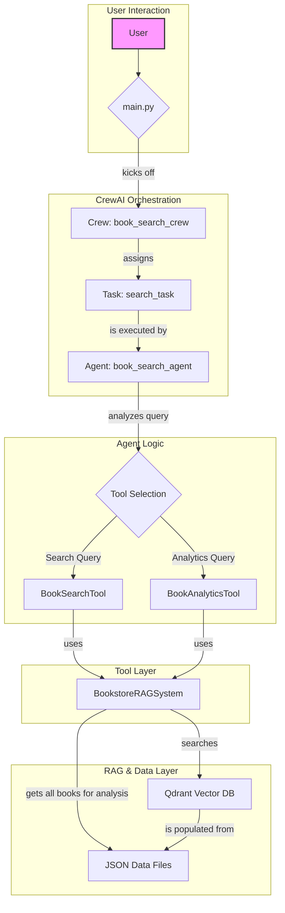

# System Architecture

This document outlines the architecture of the AI-powered book search assistant. The system is designed to handle natural language queries, perform book searches and data analysis, and manage batch processing of multiple queries.

## Core Components

The architecture is composed of several key layers:

1.  **Orchestration Layer (`main.py`)**: This is the main entry point of the application. It initializes the agents, tasks, and tools. It's responsible for managing the `Crew`, processing queries (either interactively or in a batch), and saving the final structured results to a CSV file.

2.  **AI Agent Layer (CrewAI)**: We use the CrewAI framework to define and manage our AI agent.
    *   **Agent (`book_search_agent`)**: A specialized AI agent named "Alex" with a defined role, goal, and backstory. It uses an LLM to reason about user queries and decide which tool to use.
    *   **Task (`search_task`)**: A unit of work assigned to the agent. It contains the description of the job to be done and the expected output format.
    *   **Crew (`book_search_crew`)**: Orchestrates the interaction between the agent and its task to produce a result.

3.  **Tool Layer (`tools/crew_tools.py`)**: These are the specific capabilities the agent can use to perform its tasks.
    *   **`BookSearchTool`**: Handles semantic search queries. It takes a natural language query, converts it into vector embeddings, and searches a vector database for relevant books.
    *   **`BookAnalyticsTool`**: Performs data analysis on the entire book dataset. It can answer questions about pricing, genre popularity, and other analytical insights.

4.  **Data Retrieval Layer (RAG)**: The Retrieval-Augmented Generation (RAG) system is the backbone of our data operations.
    *   **`BookstoreRAGSystem` (`book_agent.py`)**: This class encapsulates the logic for interacting with the data sources. It handles data loading, embedding generation, and querying the vector database.
    *   **Vector Database (Qdrant)**: An open-source vector database chosen for its simple APIs and powerful features. Qdrant provides efficient similarity search and supports advanced metadata filtering and phrase matching, which are critical for handling complex user queries. Its support for hybrid search makes it a versatile choice for combining keyword-based and semantic search techniques. It also allows mapping multiple vectors to a single data point, offering flexibility for future enhancements.

5.  **Data Storage Layer (`data/`)**: This layer contains the raw data.
    *   **JSON Files (`store_a_books.json`, `store_b_books.json`)**: The source of truth for all book information.
    *   **CSV File (`batch_query_results.csv`)**: The output file where structured results from batch queries are stored.

## Architecture Diagram

The following diagram illustrates the flow of information and control within the system.

